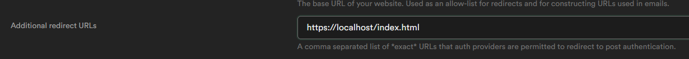

# Supabase-kt GoTrue

Extends Supabase-kt with a multiplatform GoTrue client.

Newest version: [](https://search.maven.org/search?q=g%3Aio.supabase)

# Installation

```kotlin
dependencies {
    implementation("io.github.jan-tennert.supabase:gotrue-kt:VERSION")
}
```

Install plugin in main supabase client. See [supabase-kt](https://github.com/supabase-community/supabase-kt) for more information
```kotlin
val client = createSupabaseClient {
    
    //...
    
    install(GoTrue) {
        // settings
    }
    
}
```

# Features

<details><summary>Feature table</summary>

|         | Login                                            | Signup                                           | Verifying (Signup, Password Reset, Invite) | Logout | Otp |
|---------|--------------------------------------------------|--------------------------------------------------|--------------------------------------------|--------|-----|
| Desktop | phone, password, oauth2 via callback http server | phone, password, oauth2 via callback http server | only with token                            | ✅      | ❌   |
| Android | phone, password, oauth2 via deeplinks            | phone, password, oauth2 via deeplinks            | token, url via deeplinks                   | ✅      | ✅   |
| IOS     | 🕐                                               | 🕐                                               | 🕐                                         | 🕐     | 🕐  |
| Web     | phone, password, oauth2                          | phone, password, oauth2                          | token, url                                 | ✅      | ✅   |

🕐 = to be implemented \
❌ = will not be implemented \
✅ = implemented

Session saving: ✅

</details>

<details><summary>Authentication with Desktop (Example with Compose)</summary>
<p>

<b> To add OAuth support, add this link to the redirect urls in supabase </b>



```kotlin
suspend fun main() {
    val client = createSupabaseClient {
        supabaseUrl = System.getenv("SUPABASE_URL")
        supabaseKey = System.getenv("SUPABASE_KEY")

        install(GoTrue)
    }
    application {
        Window(::exitApplication) {
            val session by client.gotrue.currentSession.collectAsState()
            val scope = rememberCoroutineScope()
            if (session != null) {
                Box(contentAlignment = Alignment.Center, modifier = Modifier.fillMaxSize()) {
                    Text("Logged in as ${session?.user?.email}")
                }
            } else {
                Box(contentAlignment = Alignment.Center, modifier = Modifier.fillMaxSize()) {
                    var email by remember { mutableStateOf("") }
                    var password by remember { mutableStateOf("") }
                    Column {
                        TextField(email, { email = it }, placeholder = { Text("Email") })
                        TextField(
                            password,
                            { password = it },
                            placeholder = { Text("Password") },
                            visualTransformation = PasswordVisualTransformation()
                        )
                        Button(onClick = {
                            scope.launch {
                                client.gotrue.signUpWith(Email) {
                                    this.email = email
                                    this.password = password
                                }
                            }
                        }, modifier = Modifier.align(Alignment.CenterHorizontally)) {
                            Text("Login")
                        }
                        Button(
                            {
                                scope.launch {
                                    client.gotrue.loginWith(Discord) {
                                        onFail = {
                                            when (it) {
                                                is OAuthFail.Timeout -> {
                                                    println("Timeout")
                                                }
                                                is OAuthFail.Error -> {
                                                    //log error
                                                }
                                            }
                                        }
                                        timeout = 50.seconds
                                        htmlTitle = "Supabase"
                                        htmlText = "Logged in. You may continue in the app."
                                    }
                                }
                            },
                            modifier = Modifier.align(Alignment.CenterHorizontally)
                        ) {
                            Icon(painterResource("discord_icon.svg"), "", modifier = Modifier.size(25.dp))
                            Text("Log in with Discord")
                        }
                    }
                }

            }
        }
    }

}
```

</p>
</details>

<details><summary>Authentication with Android (Example with Compose)</summary>

<p>
 <b> When you set the deep link scheme and host in the supabase deeplink plugin and in the android manifest you have to remember to set the additional redirect url in the subabase auth settings. E.g. if you have supabase as your scheme and login as your host set this to the additional redirect url: </b>


</p>

<blockquote>

<details><summary>MainActivity</summary>
<p>
<b> Note: you should probably use a viewmodel for suspending functions from the Supabase-Kt library </b>
</p>

<p>

```kotlin
class MainActivity : AppCompatActivity() {

    val supabaseClient = createSupabaseClient {

        supabaseUrl = "your supabase url"
        supabaseKey = "your supabase key"

        install(GoTrue) {
            scheme = "supabase"
            host = "login"
        }
    }

    override fun onCreate(savedInstanceState: Bundle?) {
        super.onCreate(savedInstanceState)
        initializeAndroid(supabaseClient) //if you don't call this function the library will throw an error when trying to authenticate with oauth
        setContent {
            MaterialTheme {
                val session by supabaseclient.gotrue.currentSession.collectAsState()
                println(session)
                val scope = rememberCoroutineScope()
                if (session != null) {
                    Box(contentAlignment = Alignment.Center, modifier = Modifier.fillMaxSize()) {
                        Text("Logged in as ${session?.user?.email}")
                    }
                } else {
                    Box(contentAlignment = Alignment.Center, modifier = Modifier.fillMaxSize()) {
                        var email by remember { mutableStateOf("") }
                        var password by remember { mutableStateOf("") }
                        Column {
                            TextField(email, { email = it }, placeholder = { Text("Email") })
                            TextField(
                                password,
                                { password = it },
                                placeholder = { Text("Password") },
                                visualTransformation = PasswordVisualTransformation()
                            )
                            Button(onClick = {
                                scope.launch {
                                    supabaseclient.gotrue.loginWith(Email) {
                                        this.email = email
                                        this.password = password
                                    }
                                }
                            }, modifier = Modifier.align(Alignment.CenterHorizontally)) {
                                Text("Login")
                            }
                            Button(
                                {
                                    scope.launch {
                                        client.gotrue.loginWith(Discord)
                                    }
                                },
                                modifier = Modifier.align(Alignment.CenterHorizontally)
                            ) {
                                Icon(painterResource("discord_icon.svg"), "", modifier = Modifier.size(25.dp))
                                Text("Log in with Discord")
                            }
                        }
                    }
                }
            }
        }
    }

}
```

</p>
</details>

<details><summary>AndroidManifest</summary>
<p>

```xml
<?xml version="1.0" encoding="utf-8"?>
<manifest xmlns:android="http://schemas.android.com/apk/res/android" package="io.supabase.android">

    <uses-permission android:name="android.permission.INTERNET"/>

    <application
            android:allowBackup="false"
            android:supportsRtl="true"
            android:theme="@style/Theme.AppCompat.Light.NoActionBar">
        <activity android:name=".MainActivity" android:exported="true">
            <intent-filter>
                <action android:name="android.intent.action.MAIN"/>
                <category android:name="android.intent.category.LAUNCHER"/>
                <action android:name="android.intent.action.VIEW"/>
                <category android:name="android.intent.category.DEFAULT"/>
                <category android:name="android.intent.category.BROWSABLE"/>
                <!-- This is important for deeplinks. -->
                <data android:scheme="supabase"
                      android:host="login"/>
            </intent-filter>
        </activity>
    </application>
</manifest>
```

</p>
</details>

</blockquote>

</details>

<details><summary>Authentication with Web (Example with Compose)</summary>

<p>

```kotlin
val client = createSupabaseClient {
    supabaseUrl = ""
    supabaseKey = ""

    install(GoTrue)
}

renderComposable(rootElementId = "root") {
    val session by client.gotrue.currentSession.collectAsState()
    var email by remember { mutableStateOf("") }
    var password by remember { mutableStateOf("") }
    val scope = rememberCoroutineScope()
    if (session != null) {
        Span({ style { padding(15.px) } }) {
            Text("Logged in as ${session!!.user?.email}")
        }
    } else {
        EmailInput(email) {
            onInput {
                email = it.value
            }
        }
        PasswordInput(password) {
            onInput {
                password = it.value
            }
        }
        Button({
            onClick {
                scope.launch {
                    client.gotrue.loginWith(Email) {
                        this.email = email
                        this.password = password
                    }
                }
            }
        }) {
            Text("Login")
        }
        Button({
            onClick {
                scope.launch {
                    client.gotrue.loginWith(Discord)
                }
            }
        }) {
            Text("Login with Discord")
        }
    }
}
```

</p>

</details>

<details><summary>Session saving</summary>

<p>

By default, supabase-kt uses [multiplatform-settings](https://github.com/russhwolf/multiplatform-settings) for session
saving and uses their default settings location e.g. on Android **PreferenceManager.getDefaultSharedPreferences()**

You can change how and where the sessions get saved by providing a custom Settings implementation in the Auth config.
See [multiplatform-settings](https://github.com/russhwolf/multiplatform-settings) for implementations.

Example on desktop:

```kotlin
install(GoTrue) {
    settings = PreferencesSettings(Preferences.userRoot().node("custom_name"))
}
```

</p>

</details>

<details><summary>Manage Users (Server Only)</summary>

**For admin methods you need the service role secret which you should never share with anyone nor include it with your
app.**

<p>

```kotlin
val client = createSupabaseClient {
    //[...]

    install(GoTrue) {
        alwaysAutoRefresh = false
        autoLoadFromStorage = false
    }

}

client.gotrue.importAuthToken("service role secret") 
```

**Get all users**

```kotlin
val users: List<UserInfo> = client.gotrue.admin.retrieveUsers()
```

**Register new users**

```kotlin
client.gotrue.admin.createUserWithEmail {
    email = "example@foo.bar"
    password = "12345678"
    autoConfirm = true //automatically confirm this email address
}
client.gotrue.admin.createUserWithPhone {
    phoneNumber = "123456789"
    password = "12345678"
}
```

**Update users**

```kotlin
client.gotrue.admin.updateUserById("uid") {
    phone = "12345679"
    phoneConfirm = true
}
```

**Generate links**

```kotlin
val (link, user) = client.gotrue.admin.generateLinkFor(LinkType.MagicLink) {
    email = "example@foo.bar"
}
val (link, user) = client.gotrue.admin.generateLinkFor(LinkType.Signup) {
    email = "example@foo.bar"
    password = "12345678"
}
```

</p>

</details>